# 🎩 화장품 비교 사이트
## frontend

------


- 상품

  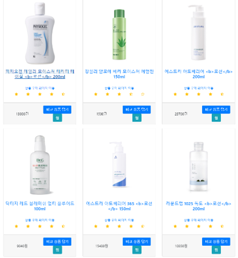

- 상품 상세정보

  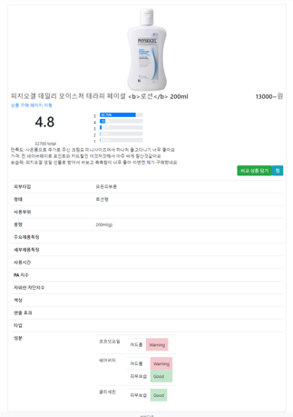

- 상품 비교

  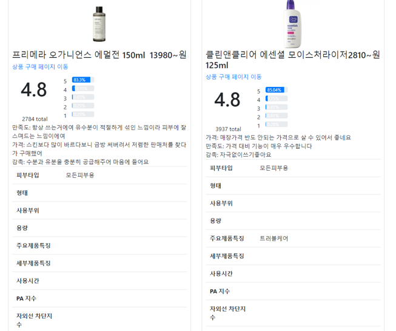

- 회원가입

  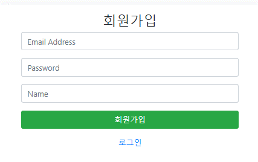

- 로그인

  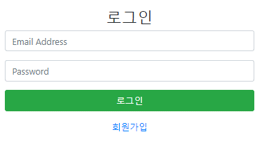

- 메시지

  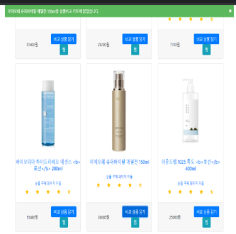

## backend

------

# 카테고리(Category) API

+ 카테고리 조회(계층 리스트)

## 카테고리 조회(계층 리스트)

### Request

#### URL

```http
GET /api/v1/categories
Host: localhost:8080
```

#### Example

```http
GET http://localhost:8080/api/v1/categories
```

### Response

```http
200 OK
```

```json
{
  id: 0,
  itemCategoryId: "0",
  title: "root",
  parentId: 0,
  children: [
    {
      id: 1,
      itemCategoryId: "50000002",
      title: "화장품/미용",
      parentId: 0,
      children: [
        {
          id: 2,
          itemCategoryId: "50000190",
          title: "스킨케어",
          parentId: 1,
          children: [
            {
              id: 3,
              itemCategoryId: "50000438",
              title: "로션",
              parentId: 2,
              children: null
            }
          ]
        },
        {
          id: 6,
          itemCategoryId: "50000191",
          title: "선케어",
          parentId: 1,
          children: [
            {
              id: 7,
              itemCategoryId: "50000447",
              title: "선스틱",
              parentId: 6,
              children: null
            }
          ]
        },
        {
          id: 8,
          itemCategoryId: "50000195",
          title: "색조메이크업",
          parentId: 1,
          children: [
            {
              id: 9,
              itemCategoryId: "50000391",
              title: "립스틱",
              parentId: 8,
              children: null
            }
          ]
        }
      ]
    }
  ]
}
```


# 화장품(Cosmetic) API

+ 화장품(정보) 조회(리스트)
+ 화장품(정보) 조회(단건)

## 화장품(정보) 조회(리스트)

### Request

#### URL

```http
GET /api/v1/items/cosmetics
Host: localhost:8080
```

#### Example

```http
GET http://localhost:8080/api/v1/items/cosmetics
```

### Response

```http
200 OK
```

```json
[
  {
    "color": "string",
    "detailFeature": "string",
    "effect": "string",
    "ingredients": [
      {
        "features": [
          {
            "id": 0,
            "name": "string",
            "status": "Good"
          }
        ],
        "id": 0,
        "name": "string"
      }
    ],
    "mainFeature": "string",
    "paRating": "string",
    "shape": "string",
    "skinType": "string",
    "sunBlockRating": "string",
    "type": "string",
    "useArea": "string",
    "useTime": "string",
    "volume": "string"
  }
]
```

## 화장품(정보) 조회(단건)

### Request

#### URL

```http
GET /api/v1/items/cosmetics/{itemId}
Host: localhost:8080
```

#### Example

```http
GET http://localhost:8080/api/v1/items/cosmetics/1
```

### Response

```http
200 OK
```

```json
{
  "color": "string",
  "detailFeature": "string",
  "effect": "string",
  "ingredients": [
    {
      "features": [
        {
          "id": 0,
          "name": "string",
          "status": "Good"
        }
      ],
      "id": 0,
      "name": "string"
    }
  ],
  "mainFeature": "string",
  "paRating": "string",
  "shape": "string",
  "skinType": "string",
  "sunBlockRating": "string",
  "type": "string",
  "useArea": "string",
  "useTime": "string",
  "volume": "string"
}
```


# 상품(Item) API

+ 상품 조회(리스트)
+ 상품 조회(단건)
+ 상품 조회(카테고리별)
+ 상품 검색(이름 검색)

## 상품 조회(리스트)

### Request

#### URL

```http
GET /api/v1/items
Host: localhost:8080
```

#### Parameter

|  Name  | Type | Description | default | Required |        example         |
| :----: | :--: | :---------: | :-----: | :------: | :--------------------: |
| offset | int  | 페이지 번호 |    0    |  false   | /api/v1/items?offset=0 |
| limit  | int  |  조회 개수  |   100   |  false   | /api/v1/items?limit=2  |

#### Example

```http
GET http://localhost:8080/api/v1/items
```

### Response

```http
200 OK
```

```json
[
  {
    "brand": "string",
    "category": {
      "children": [
        null
      ],
      "id": 0,
      "itemCategoryId": "string",
      "parentId": 0,
      "title": "string"
    },
    "hprice": "string",
    "id": 0,
    "image": "string",
    "link": "string",
    "lprice": "string",
    "maker": "string",
    "productId": "string",
    "reputation": {
      "fiveStarRatio": 0,
      "fourStarRatio": 0,
      "oneStarRatio": 0,
      "reputationId": 0,
      "reviews": [
        {
          "content": "string",
          "reviewId": 0,
          "title": "string"
        }
      ],
      "threeStarRatio": 0,
      "totalReviewCount": 0,
      "totalStarRatio": 0,
      "twoStarRatio": 0
    },
    "title": "string"
  }
]
```

## 상품 조회(단건)

### Request

#### URL

```http
GET /api/v1/items/{itemId}
Host: localhost:8080
```

#### Example

```http
GET http://localhost:8080/api/v1/items/1
```

### Response

```http
200 OK
```

```json
{
  "brand": "string",
  "category": {
    "children": [
      null
    ],
    "id": 0,
    "itemCategoryId": "string",
    "parentId": 0,
    "title": "string"
  },
  "hprice": "string",
  "id": 0,
  "image": "string",
  "link": "string",
  "lprice": "string",
  "maker": "string",
  "productId": "string",
  "reputation": {
    "fiveStarRatio": 0,
    "fourStarRatio": 0,
    "oneStarRatio": 0,
    "reputationId": 0,
    "reviews": [
      {
        "content": "string",
        "reviewId": 0,
        "title": "string"
      }
    ],
    "threeStarRatio": 0,
    "totalReviewCount": 0,
    "totalStarRatio": 0,
    "twoStarRatio": 0
  },
  "title": "string"
}
```

## 상품 조회(카테고리)

### Request

#### URL

```http
GET /api/v1/items/categories/{itemCategoryId}
Host: localhost:8080
```

#### Example

```http
GET http://localhost:8080/api/v1/items/50000002
```

### Response

```http
200 OK
```

```json
[
  {
    "brand": "string",
    "category": {
      "children": [
        null
      ],
      "id": 0,
      "itemCategoryId": "string",
      "parentId": 0,
      "title": "string"
    },
    "hprice": "string",
    "id": 0,
    "image": "string",
    "link": "string",
    "lprice": "string",
    "maker": "string",
    "productId": "string",
    "reputation": {
      "fiveStarRatio": 0,
      "fourStarRatio": 0,
      "oneStarRatio": 0,
      "reputationId": 0,
      "reviews": [
        {
          "content": "string",
          "reviewId": 0,
          "title": "string"
        }
      ],
      "threeStarRatio": 0,
      "totalReviewCount": 0,
      "totalStarRatio": 0,
      "twoStarRatio": 0
    },
    "title": "string"
  }
]
```

## 상품 검색(이름 검색)

### Request

#### URL

```http
GET /api/v1/items/search
Host: localhost:8080
```

#### Parameter

| Name  |  Type  | Description | Required |
| :---: | :----: | :---------: | :------: |
| title | String |  상품 이름  |   true   |

#### Example

```http
GET http://localhost:8080/api/v1/items/search?title=로션
```

### Response

```http
200 OK
```

```json
[
  {
    "brand": "string",
    "category": {
      "children": [
        null
      ],
      "id": 0,
      "itemCategoryId": "string",
      "parentId": 0,
      "title": "string"
    },
    "hprice": "string",
    "id": 0,
    "image": "string",
    "link": "string",
    "lprice": "string",
    "maker": "string",
    "productId": "string",
    "reputation": {
      "fiveStarRatio": 0,
      "fourStarRatio": 0,
      "oneStarRatio": 0,
      "reputationId": 0,
      "reviews": [
        {
          "content": "string",
          "reviewId": 0,
          "title": "string"
        }
      ],
      "threeStarRatio": 0,
      "totalReviewCount": 0,
      "totalStarRatio": 0,
      "twoStarRatio": 0
    },
    "title": "string"
  }
]
```


## 🚩 개요

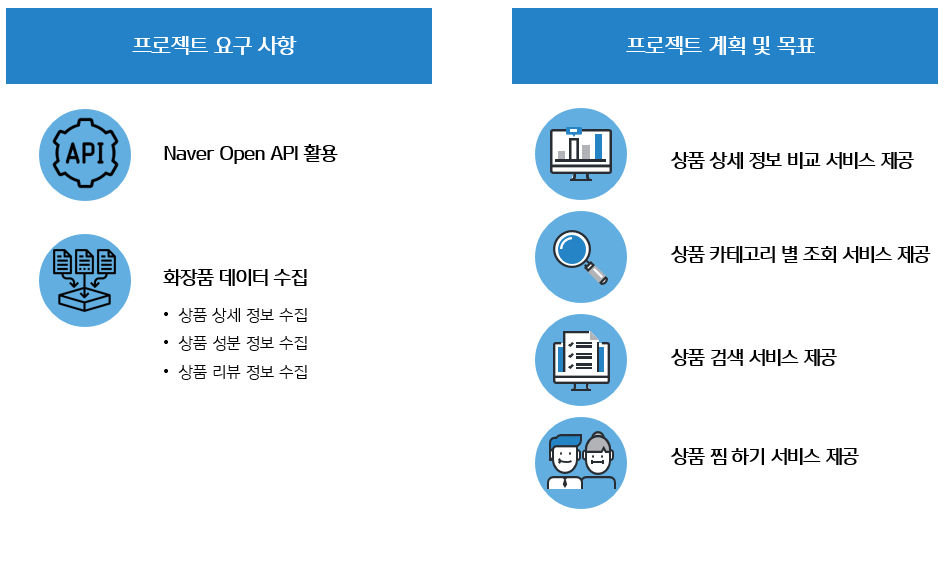

## 🛠️ 기술 스택
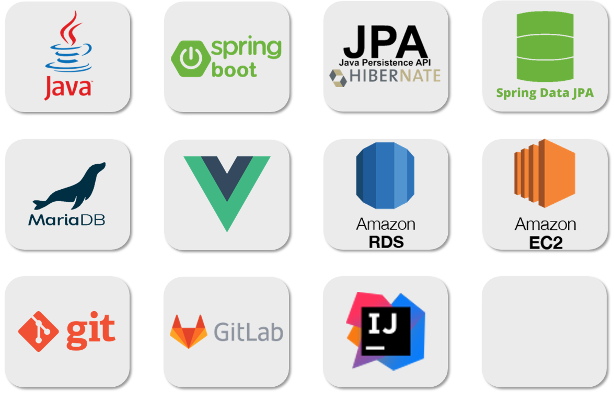

## 🏗️ 프로젝트 아키텍처
* Spring Multi Module
  + sunbi-common: 공통 모듈, API
  + sunbi-crawler: 크롤러 모듈

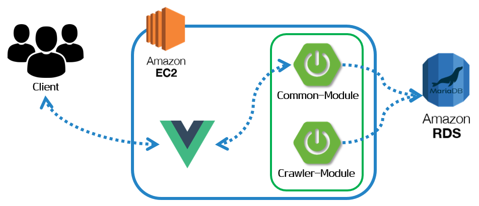

## 💻 기능(API) 소개
선비다우는 다음 **기능 및 API**를 제공합니다.

* 상품 조회(리스트, 단건, 카테고리별)
* 상품 검색(이름 검색)
* 화장품(정보) 조회(리스트, 단건)
* 카테고리 조회(계층 리스트)

API의 자세한 정보는 다음 **API 문서**를 참고해 주세요.

* [상품 API](docs/api-item.md)
* [화장품 API](docs/api-cosmetic.md)
* [카테고리 API](docs/api-category.md)

## 📜 프로젝트 설계도
### 도메인 모델
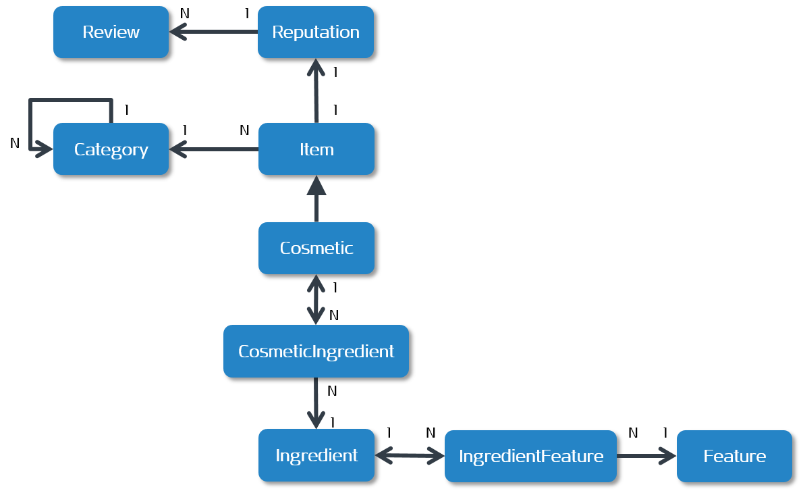


### 클래스 다이어그램(common)
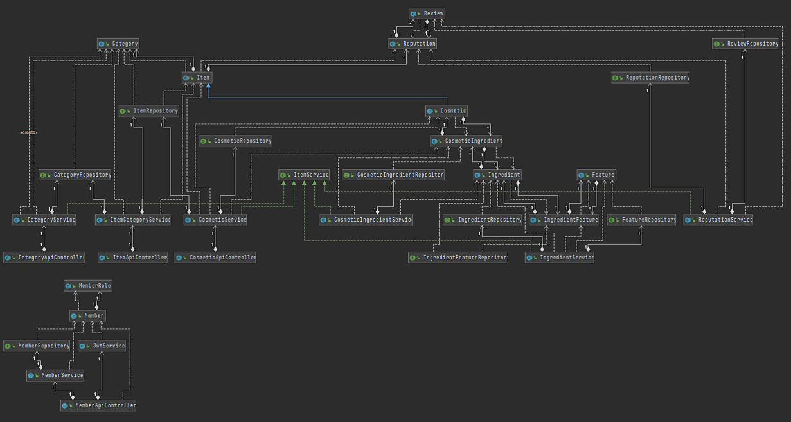


### 클래스 다이어그램(crawler)
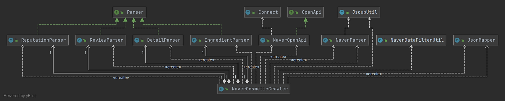

## 📌 Quick Start
### Front-End
✅ 아래 명령어를 실행하기 위해서 **git**, **node.js** 설치가 필요합니다.

```sh
git clone {project-repository-url}
```

```sh
cd {project-repository-name}/front
```

```sh
npm install
```

```sh
npm run serve
```

✅ vue (port:8080)

✅ http://localhost:8080/ 접속

### Back-End
✅ common (port:8081)

✅ crawler (port:8083)
